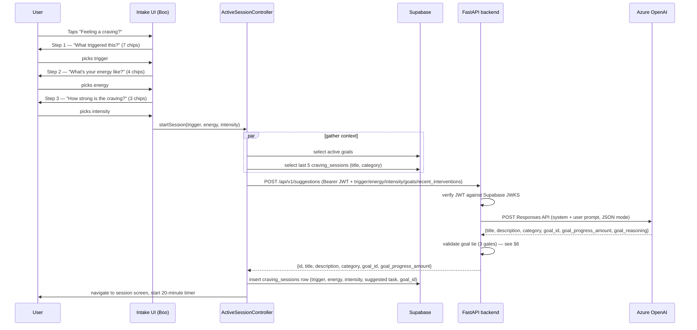
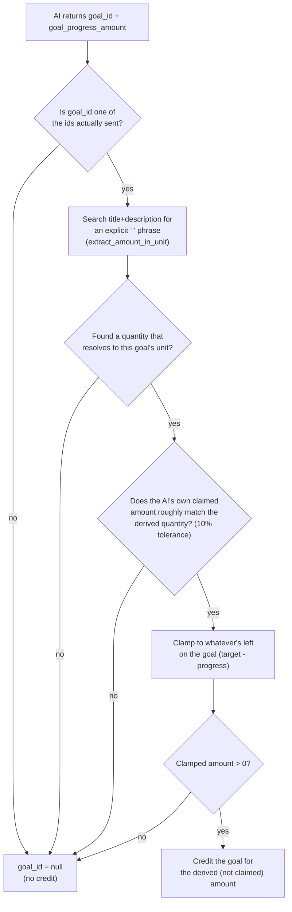

# AI Suggestion System

How the app decides what to suggest during a craving session — every actor
involved, what crosses the wire between them, and the validation pipeline
that keeps the AI honest about goal credit. Reflects the current
neuropsychology-based intake (trigger + energy + intensity) and the
8-category variety system, not the older single-trigger version.

## 1. Actors

| Actor | Role |
|---|---|
| **Flutter app** | Collects the 3-question intake, gathers context (active goals, recent intervention history), calls the backend, persists the resulting session to Supabase, runs the 20-minute timer. |
| **Supabase (Postgres + Auth)** | Source of truth for goals and session history. Issues the JWT the app authenticates with. The backend never talks to Supabase directly — only the Flutter app does. |
| **FastAPI backend** | A stateless AI gateway. Holds no database of its own; every goal/history fact it reasons about is sent inline by the Flutter client on each request. Verifies the caller's Supabase JWT, builds the prompt, calls Azure, validates the result, and falls back to a static suggestion pool if anything goes wrong. |
| **Azure OpenAI (Responses API)** | The actual model call. Treated as unreliable by design — any failure, timeout, or malformed response is caught and triggers the fallback path, never an error shown to the user. |
| **Static suggestion pool** | Not a network actor — a hardcoded list inside the backend (`TASK_SUGGESTIONS`), covering all 8 categories, used whenever Azure isn't configured or fails. |

## 2. End-to-end sequence



If Azure is unreachable, misconfigured, or returns something unparseable,
the backend logs a warning and returns a suggestion from the static pool
instead — this happens transparently inside the same request, so the
Flutter app never has to know the difference. If even the backend call
itself fails (network/timeout), `ActiveSessionController._pickTask` catches
that too and falls back to a deterministic, non-AI suggestion built from
the user's own goal data (see §7).

"Give me a different suggestion" (`refreshSuggestion`) re-runs the same
context-gathering + backend-call steps, then **updates** the existing
session row instead of inserting a new one.

## 3. What the Flutter app sends

Built in `BackendSuggestionRepository.getSuggestion()`, sent as the POST body:

```json
{
  "trigger": "anxiety",
  "local_hour": 21,
  "energy": "low",
  "intensity": "strong",
  "recent_interventions": [
    { "title": "Five senses check-in", "category": "grounding" },
    { "title": "Stretch it out", "category": "physical_movement" }
  ],
  "goals": [
    { "id": "g1", "title": "Read more", "target": 200, "unit": "pages", "progress": 40 }
  ]
}
```

`trigger`/`energy`/`intensity` are single answers from the 3-step intake.
`recent_interventions` comes from a fresh Supabase query each time (last 5
sessions, most recent first) — not an in-memory value — so variety
awareness survives app restarts and works across devices for the same
user. `goals` is every currently-active monthly goal, sent in full each
time since the backend keeps no state between requests.

## 4. What the backend asks Azure

`AzureOpenAISuggestionGenerator._build_user_prompt` turns the request into
one plain-language paragraph, e.g.:

> Their craving was triggered by: anxiety. Their local time is 21:00. Their
> current energy/capacity is: low. Their craving intensity right now is:
> strong. Their active goals: id=g1: "Read more" (40/200 pages so far).
> Their last 2 interventions, most recent first: "Five senses check-in"
> (grounding); "Stretch it out" (physical_movement). Avoid repeating these
> categories if possible. Suggest one small task now.

The system prompt (`_SYSTEM_PROMPT`) frames the model as a **behavioral
coach calibrating the next step**, not a recommendation engine optimizing
for what the user would click. In order, it's told to: (1) reduce the
immediate craving, (2) strengthen executive control/identity, (3) support
long-term goals, (4) preserve novelty, (5) suggest the smallest meaningful
achievable action. It's given the task-difficulty calibration explicitly,
with the user's own bad/too-easy/right-sized examples baked in ("Run 5 km"
too much, "Drink water" too little, "Walk outside for 5 minutes"
right-sized), told to scale difficulty down for low energy and toward
stabilization for strong intensity, told to self-classify into exactly one
of the 8 categories, and told to avoid repeating any category from the
recent-interventions list, not just the latest one.

It must respond with compact JSON only:

```json
{
  "title": "<=6 words",
  "description": "<=20 words",
  "category": "<one of the 8 categories>",
  "goal_id": "<one of the given ids, or null>",
  "goal_progress_amount": 0.25,
  "goal_reasoning": "<=15 words, debug-only, no effect on behavior>"
}
```

If the configured model is a reasoning model (`gpt-5`, `o1`, `o3`, ... —
detected by `is_reasoning_model`), the request adds `reasoning.effort:
minimal` and a bumped token budget, since those models silently spend part
of the budget on hidden reasoning before producing any visible text.
`extract_output_text` then finds the actual message in the response
(reasoning models put a non-text `reasoning` item first, so the message
can't be assumed to be `output[0]`).

## 5. The 8 categories

`reading, physical_movement, grounding, reflection, breathing, learning,
environment_change, social_connection`. The AI must self-classify every
suggestion into one of these (previously hardcoded to a single category
for every AI suggestion — a real gap fixed alongside this system). An
invalid or missing category falls back to `reflection`, logged as
`category_fallback=True`, the same defensive pattern used for an invalid
`goal_id`.

## 6. Validating the goal tie — three independent gates, in order



1. **Known goal.** `goal_id` must be one of the ids actually sent in the
   prompt. Anything else (including a hallucinated id) becomes `None`.
2. **Quantity derivable.** `extract_amount_in_unit` (in
   `app/integrations/quantity_extraction.py`) searches the task's own
   title/description for an explicit `"<quantity> <unit>"` phrase that
   resolves to the goal's unit — either the literal word (e.g. "4 pages"
   for a `pages` goal) or, for time units, a convertible one (e.g. "15
   minutes" satisfies an `hours` goal: 15 × 1/60 = 0.25). **There is no
   hardcoded list of forbidden units** — any unit is eligible as long as
   the task's own text actually states a matching quantity. If nothing
   resolves, the goal gets no credit.
3. **Claim cross-check.** The AI's own stated `goal_progress_amount` must
   roughly agree with what was just derived from its own text
   (`math.isclose`, 10% relative / 0.05 absolute tolerance). A meaningful
   mismatch means something is inconsistent — e.g. a fabricated
   justification for an unrelated task — and neither number is trusted.

Only after all three gates pass does the **derived** amount (not the AI's
claimed one) get clamped to whatever's left on the goal
(`target - progress`) and credited — and dropped entirely if that clamps to
0 (goal already complete).

### Why backstops, not just prompt wording

The system prompt alone wasn't reliable enough in testing: the model
sometimes claimed a goal it had been explicitly told not to (crediting a
full "hour" toward an hours-based goal for a 2-minute task) or fabricated a
justification for a task that had nothing to do with the goal (a muscle
relaxation exercise credited as "reading pages"). These three gates are
deterministic and can't be talked around by the model, so this class of
bug can't silently recur even if the prompt is reworded or the underlying
model is swapped.

## 7. Failure modes and what happens instead

| Failure | What happens |
|---|---|
| Azure not configured (no endpoint/key) | `SuggestionService` skips the AI entirely, returns from the static pool. |
| Azure call fails (network, timeout, 4xx/5xx, malformed JSON, missing field) | `AzureOpenAISuggestionGenerator` raises `AISuggestionUnavailableError`; `SuggestionService` catches it and returns from the static pool. |
| Backend itself unreachable, or the HTTP call from Flutter fails/times out | `ActiveSessionController._pickTask` catches it and builds a suggestion locally: one unit of whatever active goal exists (`"<goal title> 1 <unit>"`), with category guessed from the unit (km/session → physical_movement, pages/book → reading, hour/minute → learning, else → reflection). If there's no active goal either, it picks randomly from `LocalTaskSuggestionRepository`'s static pool. |

At every layer, a broken or slow AI provider degrades to *something
reasonable*, never to an error blocking the 20-minute delay.

## 8. Logging

Every decision is logged in one line per request
(`app.suggestions` logger): the final `category`/`goal_id`/amount, whether
either fell back to a safe default (`category_fallback`,
`claim_mismatch`), and the AI's own stated `goal_reasoning` — a debug-only
field with zero effect on behavior, included purely so the logs show what
the model *thought* it was doing even when the code overrides it.
